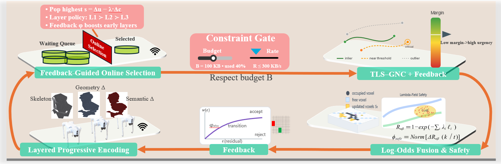
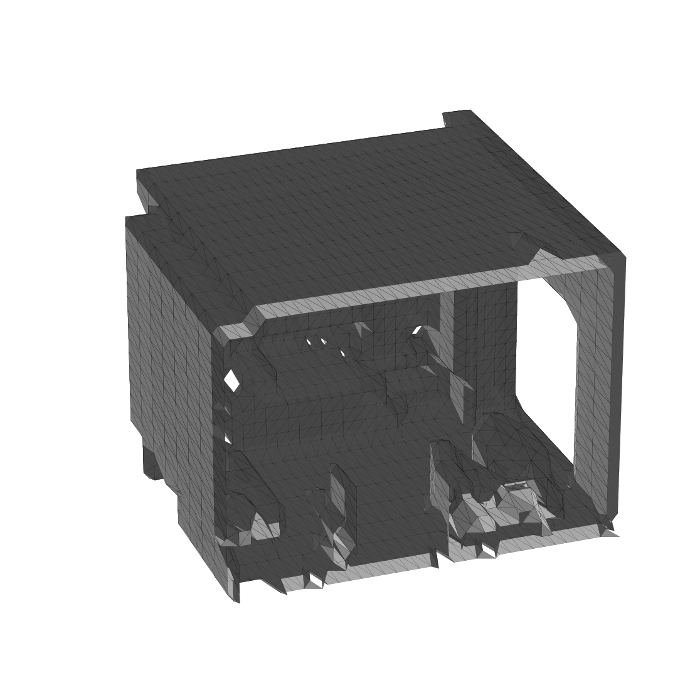
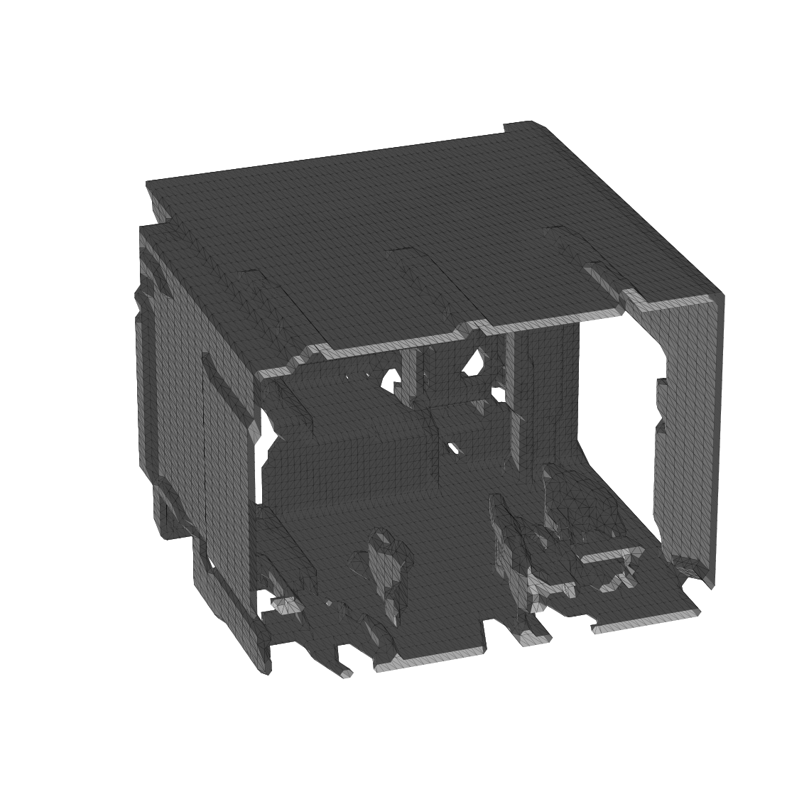
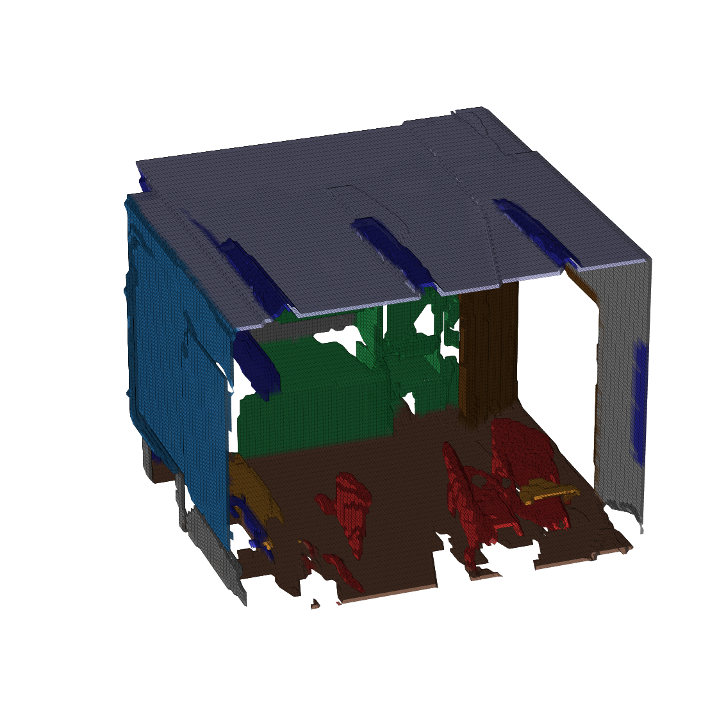
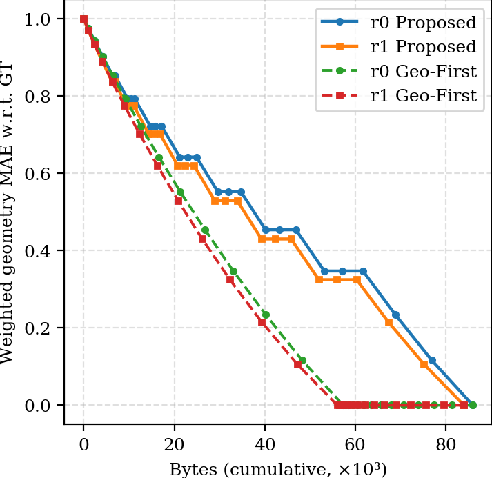
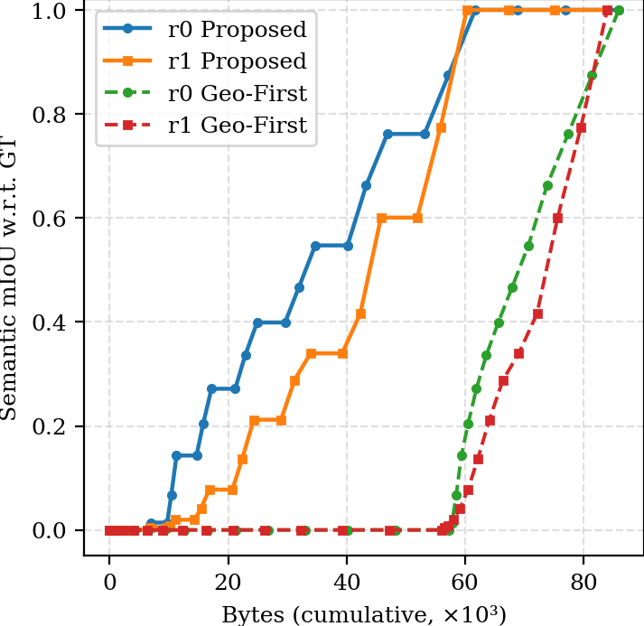

# Semantic Submap Hierarchical Transmission (SSPT) — Layered & Prefix-Decodable Spec

This repository defines the **L1/L2/L3** layered encoding for *progressive, prefix-decodable* transmission of **semantic submaps** across multiple robots and a centralized fusion node.At the sametimes,this repository implements the layered model described as Table I in the manuscript.

## Figures

<p align="center">
  
</p>

<p align="center">
  
  
  
</p>

<p align="center">
  
  
</p>


> We extend the classic progressive (layered + incremental) transmission paradigm to **3D voxel + semantics** and make it compatible with **robust PGO** and **octree occupancy fusion**.

## Layers (TL;DR)
| Layer | Purpose | Minimal payload (MUST) | Optional (SHOULD/ MAY) |
|---|---|---|---|
| **L1 — Skeleton** | Make a consistent global frame fast | Submap poses, graph edges (odometry/loop closures) with info, time/version | Sparse geometry (key landmarks), calibration digest |
| **L2 — Geometry Δ** | Coarse geometry for planning/coverage | Octree block IDs, voxel occupancy **ΔL** , block resolution | Colors, normals, timestamps, view angles |
| **L3 — Semantics Δ** | High-res + semantics | Per-voxel class distribution (logits/probabilities) **Δ**, instance IDs/merge hints, attributes | Relations (scene graph edges), uncertainty stats |

**Prefix-decodable:** Applying `L1 → (L2 Δ)* → (L3 Δ)*` in order yields a valid map at any prefix. Each Δ contains only the *minimal* payload to upgrade from previous level(s).Run scripts/demo_roundtrip.sh to verify order-independence and prefix-decodability.


## Files
- `specs/` — human-readable normative specs (MUST/SHOULD/MAY).
- `schemas/` — JSON Schemas for payload validation.
- `proto/` — Protobuf messages for wire format.
- `ros_msgs/` — ROS msg stubs (optional).
- `examples/` — Minimal valid payload examples.
- `diagrams/` — Figures for papers.
- `scripts/` — Utilities (validation).
- `examples/*_example.json` are **payload-only** examples (what the layer actually contains).
- `examples/*_msg.json` are **transport-level** messages with the common SSPT header
  (submap_id, robot_id, layer, version, stamp, payload, crc).
## Quick demo
To verify that SSPT messages can be applied **out of order** and still build a
consistent submap state, run:
```bash
python scripts/check_order_independence.py


## License
MIT. See `LICENSE`.

## Citation
See `CITATION.cff`.
